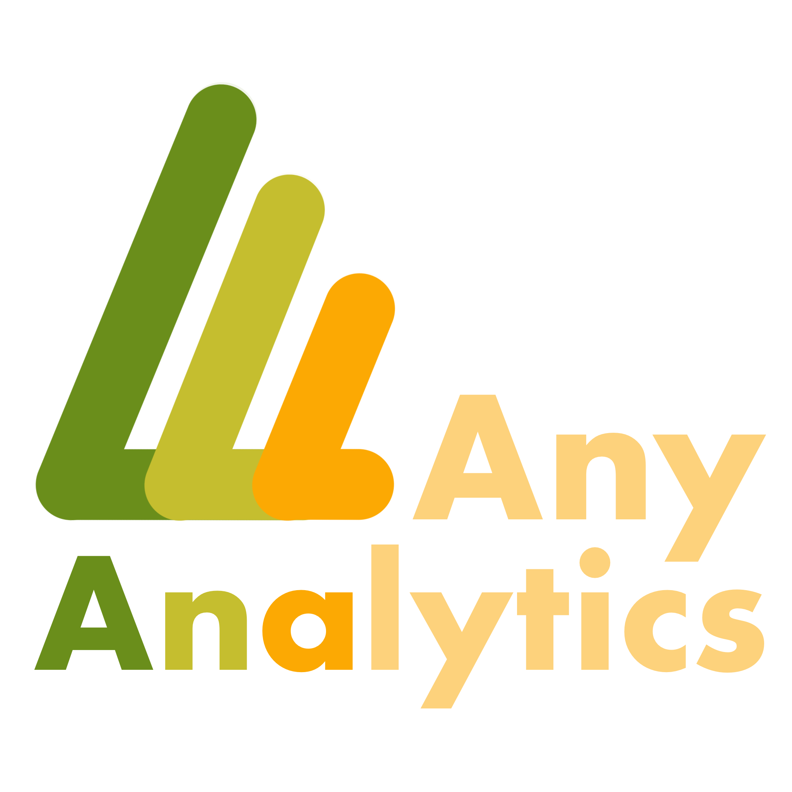

# AnyAnalytics - analytics for iOS projects written with swift




Library for easily integration analytics into your project.

This library perfectly works with [SwiftAnalyticsGen](https://github.com/alexfilimon/swift-analytics-gen) - tool for automatically generating swift/kotlin/dart code from Google Spreadsheet file.

## Installation

`pod 'AnyAnalytics'`

## How to use

1. Create your own realization of `AnalyticsEvent`/`AnalyticsUserProperty`/`AnalyticsProvider` protocols
2. In `AppDelegate` file add your realizations of `AnalyticsProvider` protocol to `AnalyticsManager.shared`

```swift
AnalyticsManager.shared.add(providers: [
    YandexAnalyticsProvider(),
    GoogleAnalyticsProvider(),
    ...
])
```

3. Call event or user property from code

```swift
AnalyticsManager.shared.track(event: PurchaseAnalyticsEvent())
AnalyticsManager.shared.track(userProperty: WishlistAnalyticsUserProperty())
```

## Idea


The main idea of library is dividing all working process with analytics layer into 3 parts:

1. Project independent layer - your own events and user properties
2. Project reusable layer - providers, that can be moved accross different projects
3. Library layer - protocols and `AnalyticsManager`, that holds in separate module

## How to release new version

1. Bump version (in podspec file)
2. Create tag with name of version (`git tag {new_version}`) and push it to origin (`git push origin {new_version}`)
3. `pod trunk push`
