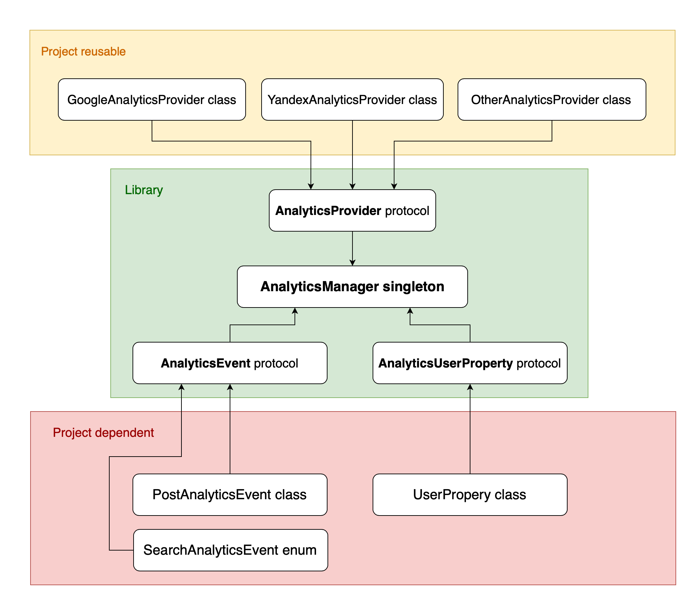

# Swift Analytics

Library for easily integration analytics into your project.

## Installation

`pod 'swift-analytics'`

## How to release new version

1. Bump version (in podspec file)
2. Create tag with name of version (`git tag {new_version}`) and push it to origin (`git push origin {new_version}`)
3. `pod trunk push`
